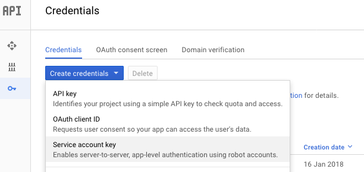
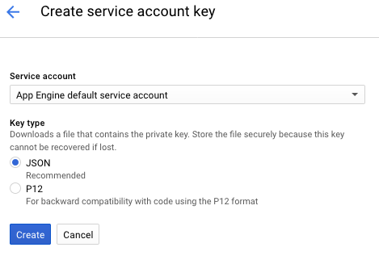

# Secrets / Credentials

- [SSH](#ssh)
- [Google Cloud](#gc)
- [AWS](#aws)
- [MySQL](#mysql)
- [Posgress](#pg)
- [Slack](#slack)
    
Endly, on its core, uses SSH and other system/cloud service requiring credentials. These services accept either an URL or just a name of filename without an extension from ~/.secret/ folder

Endly uses the credential config stored in $HOME/.secret/ folder, it uses blowfish encrypted password when created by "endly -c option."

Endly was designed in a way to hide user secrets. For example, if sudo access is needed, endly will output sudo in the execution event log and screen rather actual password.


<a name="ssh"></a>
### SSH Credentials   


To generate credentials file to enable endly exec service to run on localhost:

Provide a username and password to login to your box.

```text
mkdir $HOME/.secret
ssh-keygen -b 1024 -t rsa -f id_rsa -P "" -f $HOME/.secret/id_rsa
touch ~/.ssh/authorized_keys
cat $HOME/.secret/id_rsa.pub >>  ~/.ssh/authorized_keys 
chmod u+w authorized_keys

endly -c=localhost -k=~/.secret/id_rsa
```


Verify that secret file were created
```text
cat ~/.secret/localhost.json
```     
Now you can use ${env.HOME}./secret/localhost.json as you localhost credentials.

On OSX make sure SSH login is enabled.
     

<a name="gc"></a>
### Google Cloud Credentials
(BigQuery, Google Storage, GCE)


In the [google cloud console](https://console.cloud.google.com/?pli=1)

1. Select project
2. Select API and Services
3. Enable Big Query API
4. Select API and Services/Credentials to create Service account key. 
5. Use Default App Engine service account and JSON key type 
6. Copy created credentials to ~/.secret/bq.json


<a name="aws"></a>
### ASW Credentials   

Create a JSON file with the following details in the ~/.secret/aws.json

```json
{
        "Region":"REGION",
        "Key":"KEY",
        "Secret":"SECRET"
}
```

<a name="mysql"></a>
### MySQL Credentials


```bash
endly -c=mysql
```
Provide username root, and your password


<a name="pg"></a>
### PostgreSQL Credentials


```bash
endly -c=pg
```
Provide username root, and your password


<a name="slack"></a>
### Slack Credentials   

```bash
endly -c=slack
```
Provide username as you bot name, and bot token as a password